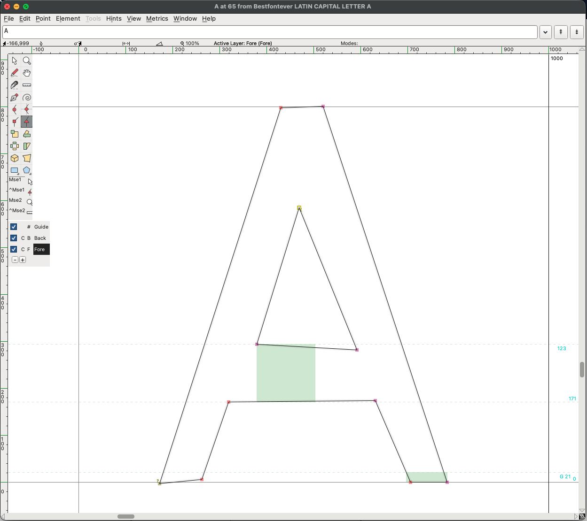
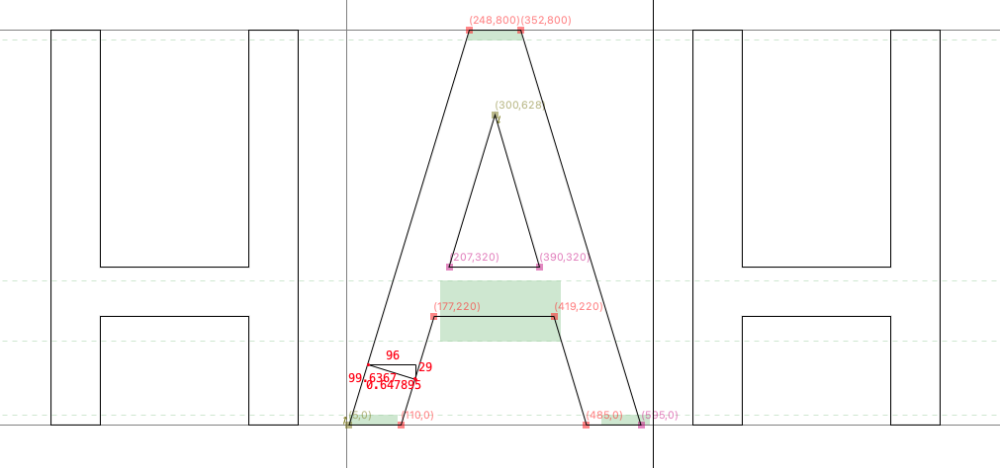
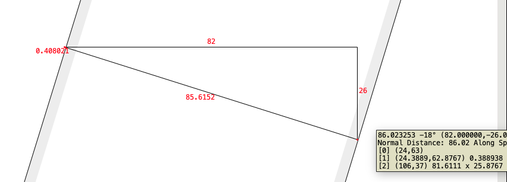
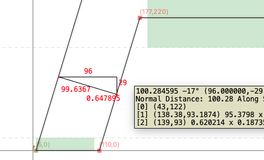
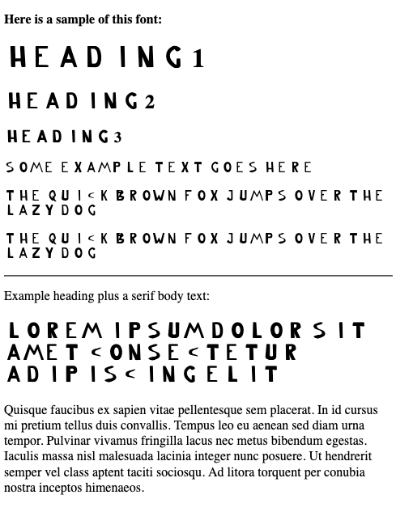

# Designing the best font ever

## The goal

My goal with this font is to create a font like Avenir, DM Sans, Silurum, Merel, but with the following priorities:

1. To be used in (mostly large) headings online, and all-caps word mark
2. Start with a light weight (i.e., 200 or so)
3. Fairly high x-height compared to the cap height
4. Circle shapes for round letters such as O, Q, C, a, b, etc.
5. Cross strokes fairly low (e.g. A, R, Y)
6. Generally wide letters (wider than DM Sans; Silurum is okay)

### But why?

For fun and learning!

## Day 2 (2025-12-20)

### Rating

***0/5 stars***

Nothing really changed since yesterday

### Progress

Let's work on a few letters. I started with I, H, and A.

Here's the letter A I had yesterday:

And here's the A after, shown in context with the capital H:

I had to do some math to get the A in the right shape. Currently the slope angle is 18 degrees, but it makes the A a bit too narrow for my liking.

Also, I think the stroke width is far too big now. It's currently 100 wide, but that's too much for this font.

[See the font in action here!](2025-12-20/sample.html)

## Day 1 (2025-12-19)

### Rating

***0/5 stars***

Well, at least it can be used to display text...

### Progress

Installed FontForge (on macOS), and literally only created 26 glyphs to cover the letters A-Z, and copy pasted those to the lower case letters a-z. I created the glyphs not thinking at all, just making them look a bit like a sans-serif font, using the path tools only.

[See the font in action here!](2025-12-19/sample.html)

## References

  * https://typedesignresources.com/
  * https://letterparts.com/
  
  
