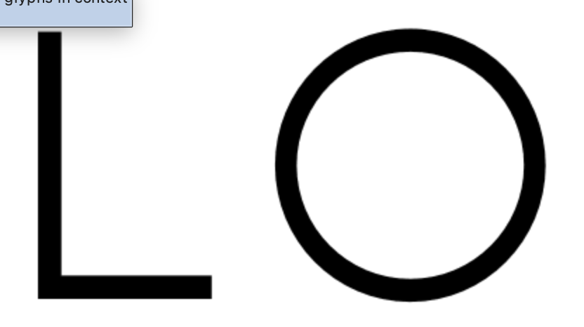
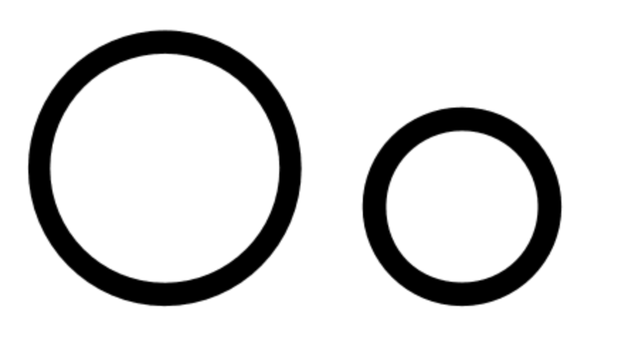
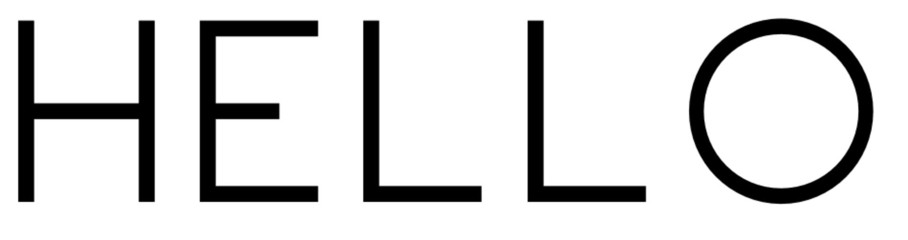
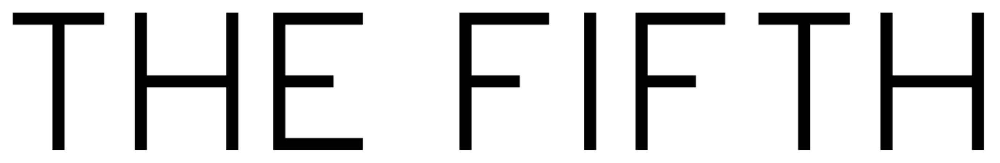
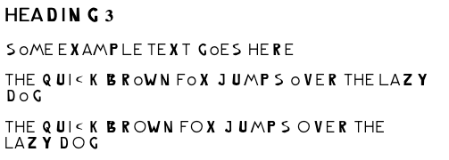
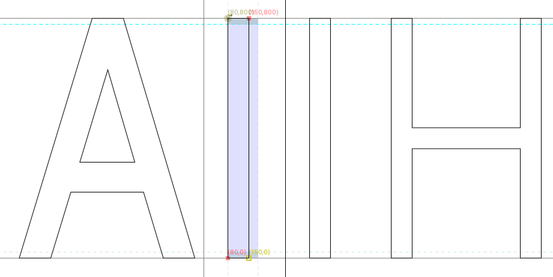
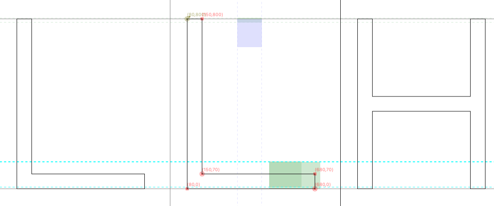
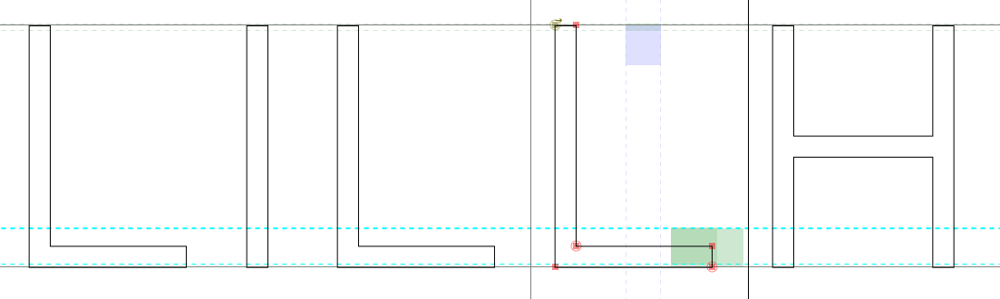
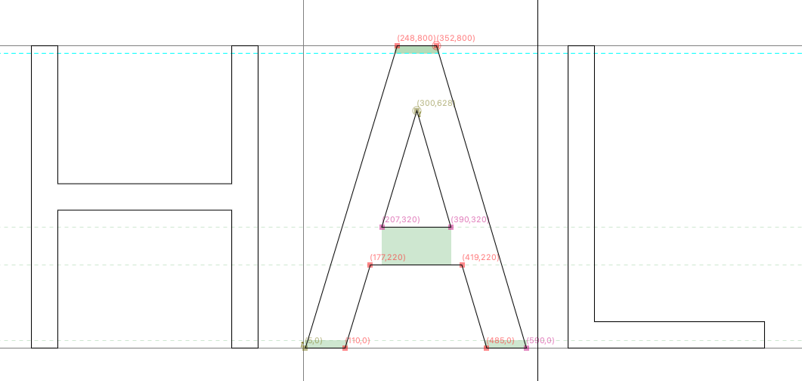
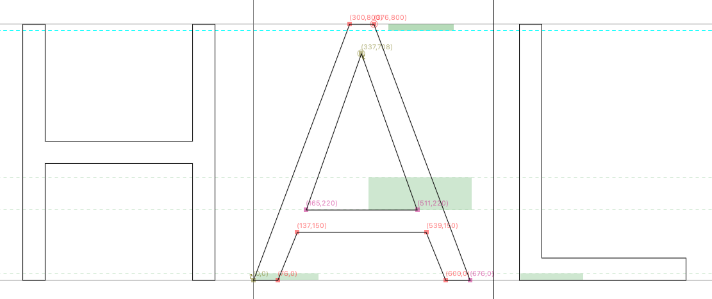

# Designing the best font ever

## The goal

My goal with this font is to create a font like Avenir, DM Sans, Silurum, Merel, but with the following priorities:

1. To be used in (mostly large) headings online, and all-caps word mark
2. Start with a light weight (i.e., 200 or so)
3. Fairly high x-height compared to the cap height
4. Circle shapes for round letters such as O, Q, C, a, b, etc.
5. Cross strokes fairly low (e.g. A, R, Y)
6. Generally wide letters (wider than DM Sans; Silurum is okay)

### But why?

For fun and learning!

## Day 3 (2025-12-21)

### Rating

***0/5 stars***

Nothing really changed since yesterday, it's still a pretty unusable font.

### Progress

Let's get to work on the `O` and `o`. These should be circles.

Not terrible. It's got a little overshoot already, but I just winged the amount. The stroke width seems a little off compared to the other letters, it seems I'm not good with simple math. I think what's going on is that when drawing a circle, FontForge is fine to snap one edge of the circle to a guideline, but let the other three anchors free. So the circles are not perfect.

Couple of annoying things about FontForge: 
  * It crashes rather frequently
  * When placing guide lines, you don't see the coordinate value
  * Changing the size of a circle requires manual editing of the bezier curves
  
Anyway, let's do `E` and `F` next, just copy the dimensions from the `L`.

Hmm, still terrible, but getting somewhere at least.

Adding the `T`, a little bit narrower than the `E`:

At least it's legible :)

Okay, we're certainly getting somewhere with this. Not necessarily somewhere good, but somewhere.

[See the font in action here!](2025-12-21/sample.html)

### Progress

## Day 2 (2025-12-20)

### Rating

***0/5 stars***

Nothing really changed since yesterday

### Progress

Let's work on a few letters. I started with I, H, and A.

Here's the letter A I had yesterday:

And here's the A after, shown in context with the capital H:

I had to do some math to get the A in the right shape. Currently the slope angle is 18 degrees, but it makes the A a bit too narrow for my liking.

Also, I think the stroke width is far too big now. It's currently 100 wide, but that's too much for this font.

The cross bar on the `H` is obviously too low, raising it to the middle. The `E` and `L` seem nice to cover next.

Also, I'm reducing the line width to 70. See the work in progress: `H` and `I` updated, `A` is still thicker.

I suppose I need to get serious about some of the ratios. Let's see, the ratio between the cap height and width of the capitals, let's start with:

  * `H`, `E`, `N`: 800/600
  * `O`, `Q`: 800 / 800 (want to keep those real circles
  * `M`: Let's figure this one out later
  
The `L`:

Yeah we need to make that a bit narrower, though we can fix details later.

The `A`: 

Let's lower the cross bar, make the strokes 70 instead of 100, and widen the letter overall (the angle was 72 degrees, it's 68 now).

[See the font in action here!](2025-12-20/sample.html)

## Day 1 (2025-12-19)

### Rating

***0/5 stars***

Well, at least it can be used to display text...

### Progress

Installed FontForge (on macOS), and literally only created 26 glyphs to cover the letters A-Z, and copy pasted those to the lower case letters a-z. I created the glyphs not thinking at all, just making them look a bit like a sans-serif font, using the path tools only.

[See the font in action here!](2025-12-19/sample.html)

## References

  * [https://typedesignresources.com/](https://typedesignresources.com/)
  * [https://letterparts.com/](https://letterparts.com/)
  * [https://www.youtube.com/watch?v=LR-CG5eB3nQ](https://www.youtube.com/watch?v=LR-CG5eB3nQ)
  
