# Designing the best font ever

## The goal

My goal with this font is to create a font like Avenir, DM Sans, Silurum, Merel, but with the following priorities:

1. To be used in (mostly large) headings online, and all-caps word mark
2. Start with a light weight (i.e., 200 or so)
3. Fairly high x-height compared to the cap height
4. Circle shapes for round letters such as O, Q, C, a, b, etc.
5. Cross strokes fairly low (e.g. A, R, Y)
6. Generally wide letters (wider than DM Sans; Silurum is okay)

### But why?

For fun and learning!

## Day 5 (2025-12-23)

### Progress

I watched [https://www.youtube.com/watch?v=LR-CG5eB3nQ](https://www.youtube.com/watch?v=LR-CG5eB3nQ) yesterday, and this explains why the lower case letters' stroke widths seem bigger than for the caps. The entire feel of the font did not turn out to be light at all. I will address this later when adding variable widths; for now I'm just going to call this font Light (300) instead of ExtraLight (200).

First get the draft `D`, `B`, `P`, `Q`, `G`, and `R` implemented.

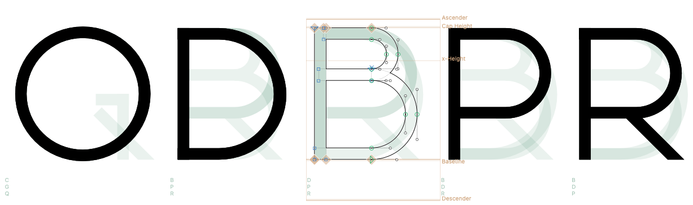

This is starting to look like a real font now. Just a few more letters left!

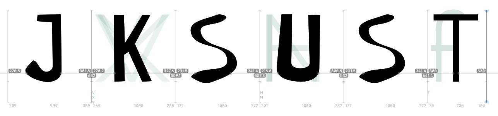

For the `U`, I'm stealing the curve from the `P`, that seems roughly the right size. But no, it isn't. That's too narrow: The H and U look like they should roughly be the same width. The N (Thanks, 'Show Siblings' plug-in!) is a little wider yet, but I'm parking that for now.

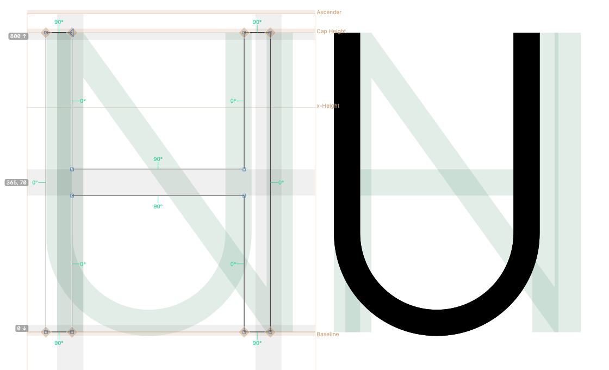

Oh man, the `S` and `s` shapes/curves are terrible to get right. I spent too much time today on these, but not nearly enough yet.

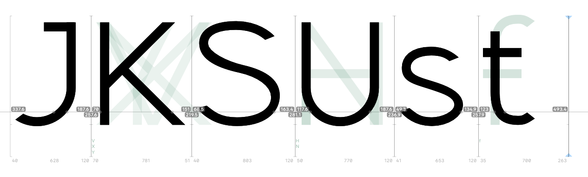

Alright. So now we've got a draft font to work with. The approach I will take is:

1. Pick one letter to improve, and make it look better (not perfect, just 'better' in some way)
2. Zoom out, and prioritize the remaining work
3. Repeat

The first thing I improved: made the space character wider (+38%). This makes longer text much more digestible:

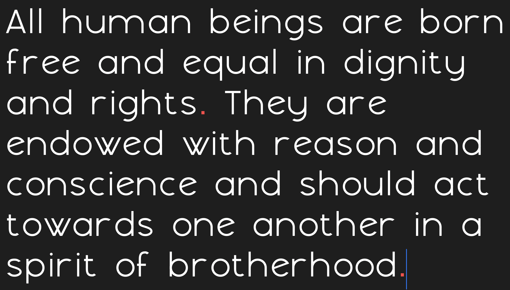

[See the font in action here!](2025-12-23/sample.html)

## Day 4 (2025-12-22)

### Progress

For some reason, the `e` is not rendered properly. There was a red node somewhere, I've removed it, and fixed the contour orientation. It's still a terrible `e` though, but I'll fix that later. Let's get some more letter shapes done better.

`x`, `v`, `X`, `V`, all should be fairly straightforward. `z` and `Z` are a little trickier. I'm going through the remaining letters fast now, not thinking about them too much. `W` and `v` and `M` are now just `V`'s stitched together.

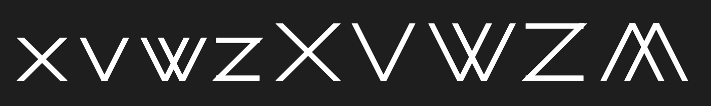

And for shits and giggles I'll make the `m` a double `n`. Hahaha this is so terrible, I love it.

One thing to address now is that the spaces are pretty narrow for the font. I know I have to take a careful look at letter spacing later, but it's getting on my nerves. Let's fix that by adding the space glyph and make it twice as wide.

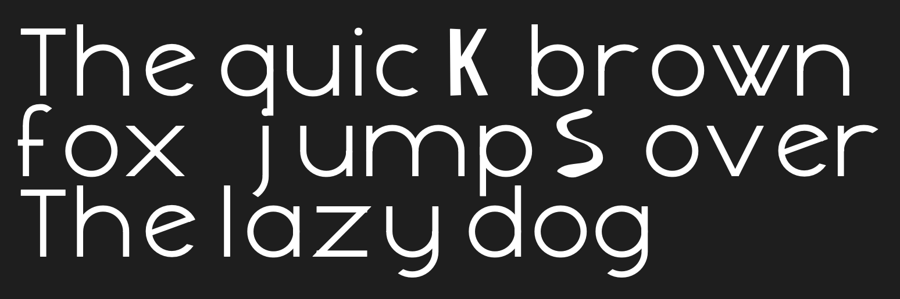
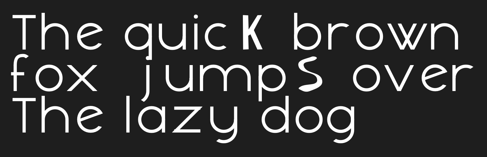

And since we're seeing overlap between lines, let's make the line height bigger and follow [https://glyphsapp.com/learn/vertical-metrics](https://glyphsapp.com/learn/vertical-metrics).

Took some time to check out Glyph's plugins and scripts, some of those are useful, in particular 'Show Siblings'.

The `Y` is interesting. I thought I could copy a `V` and add a stem, but that doesn't really work out.

[See the font in action here!](2025-12-22/sample.html)

## Day 3 (2025-12-21)

### Rating

***0/5 stars***

Nothing really changed since yesterday, it's still a pretty unusable font.

### Progress

Let's get to work on the `O` and `o`. These should be circles.

Not terrible. It's got a little overshoot already, but I just winged the amount. The stroke width seems a little off compared to the other letters, it seems I'm not good with simple math. I think what's going on is that when drawing a circle, FontForge is fine to snap one edge of the circle to a guideline, but let the other three anchors free. So the circles are not perfect.

Couple of annoying things about FontForge: 
  * It crashes rather frequently
  * When placing guide lines, you don't see the coordinate value
  * Changing the size of a circle requires manual editing of the bezier curves
  
Anyway, let's do `E` and `F` next, just copy the dimensions from the `L`.

Hmm, still terrible, but getting somewhere at least.

Adding the `T`, a little bit narrower than the `E`:

At least it's legible :)

Okay, we're certainly getting somewhere with this. Not necessarily somewhere good, but somewhere.

### Glyphs

Okay I'm already getting annoyed by the instability, awkward UI, and slowness of FontForge. I have installed Glyphs now, which comes with a 30-day trial. There is no direct import available of the .sfd files, so I imported a generated .otf file.

I'm pleased by its speed. This could be good.

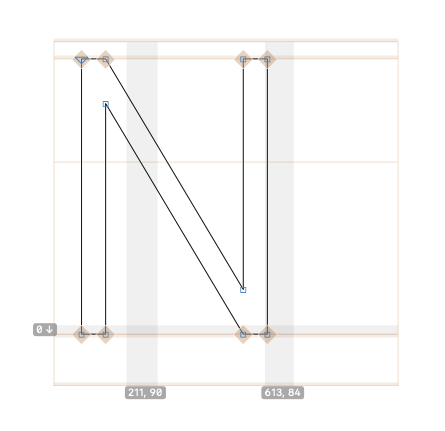

Yeah except let's make it wider...

Alright, I re-did the `O` and `o`, and used those to create the `C`, `c`, `a`, `b`, `d`, `p`, and ... hold on. The x-height is too low.

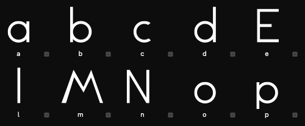
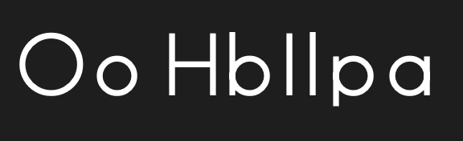

Yeah, we're just recreating other fonts that look like this. Here's the current font info:

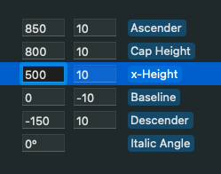

Let's make those lower case letters larger, let's say 600? Another thing I notice here is the ascenders/descenders are not the same length. Let's fix that too.

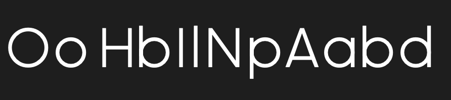

Much better! There are many visual inconsistencies between these letters, we'll fix those later. I will say that working with Glyphs at this point outperforms FontForge in both ease of use and speed.

I continued adding a bunch more lower case letters, based on the `o` shape. These are all wrong, but we'll get to that later, I just want to get most of the letters in a reasonable shape now.

[See the font in action here!](2025-12-21/sample.html)

### Progress

## Day 2 (2025-12-20)

### Rating

***0/5 stars***

Nothing really changed since yesterday

### Progress

Let's work on a few letters. I started with I, H, and A.

Here's the letter A I had yesterday:

And here's the A after, shown in context with the capital H:

I had to do some math to get the A in the right shape. Currently the slope angle is 18 degrees, but it makes the A a bit too narrow for my liking.

Also, I think the stroke width is far too big now. It's currently 100 wide, but that's too much for this font.

The cross bar on the `H` is obviously too low, raising it to the middle. The `E` and `L` seem nice to cover next.

Also, I'm reducing the line width to 70. See the work in progress: `H` and `I` updated, `A` is still thicker.

I suppose I need to get serious about some of the ratios. Let's see, the ratio between the cap height and width of the capitals, let's start with:

  * `H`, `E`, `N`: 800/600
  * `O`, `Q`: 800 / 800 (want to keep those real circles
  * `M`: Let's figure this one out later
  
The `L`:

Yeah we need to make that a bit narrower, though we can fix details later.

The `A`: 

Let's lower the cross bar, make the strokes 70 instead of 100, and widen the letter overall (the angle was 72 degrees, it's 68 now).

[See the font in action here!](2025-12-20/sample.html)

## Day 1 (2025-12-19)

### Rating

***0/5 stars***

Well, at least it can be used to display text...

### Progress

Installed FontForge (on macOS), and literally only created 26 glyphs to cover the letters A-Z, and copy pasted those to the lower case letters a-z. I created the glyphs not thinking at all, just making them look a bit like a sans-serif font, using the path tools only.

[See the font in action here!](2025-12-19/sample.html)

## References

  * [https://typedesignresources.com/](https://typedesignresources.com/)
  * [https://letterparts.com/](https://letterparts.com/)
  * [https://www.youtube.com/watch?v=LR-CG5eB3nQ](https://www.youtube.com/watch?v=LR-CG5eB3nQ)
  
